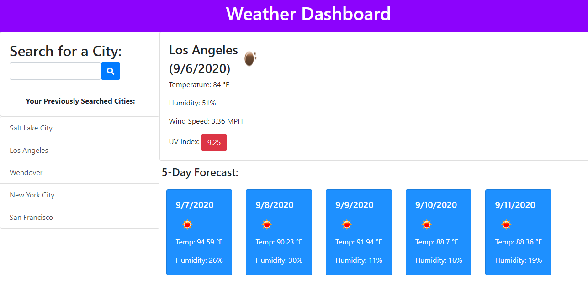

# Weather Dashboard - Challenge 6

## Purpose

Third-party API's allow developers to access theri data and functionality by making requests with specific parameters to a URL. The Weather Dashboard will retrieve weather data for cities.

## Task

- When searching for a city, user is presented with weather conditions
- Searching for a city includes: City Name, Date, and Icon Representing Weather
- Weather conditions include: Temperature, Humidity, Wind Speed, and UV Index
- Forecast displays 5 days
- Shows a list of past searched cities

## Screenshots of Deployed Application

Salt Lake City

Los Angeles

## URL to Deployed Application

https://thomasnguyen546.github.io/Weather-Dashboard/